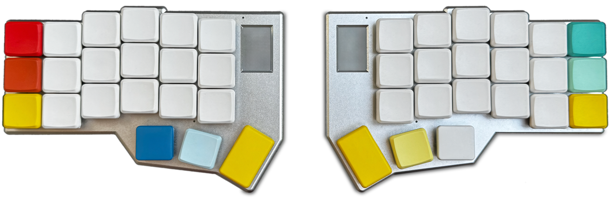

# 👊 Knucklehead

[](https://github.com/minusfive/zmk-config/actions/workflows/build.yml) [](https://github.com/minusfive/zmk-config/actions/workflows/draw.yml)

Knucklehead[^1] is a mnemonic, macOS-optimized, 42 key ergonomic columnar layout for [corne-style split keyboards](https://github.com/foostan/crkbd), designed[^2] to ease the transition from standard ANSI Apple-style keyboards.

> [!WARNING]\
> [Home Row Mods](#timer-less-home-row-mods) are now the default. Previous version available on the [legacy branch](https://github.com/minusfive/zmk-config/tree/legacy).
>
> Under **_active development_**. Expect breaking changes and scarce/incomplete documentation.




> Drawn with [@caksoylar's Keymap Drawer](https://github.com/caksoylar/keymap-drawer)

## Legend

| Symbol | Key Name                                     | Symbol | Key Name                                                  |
| :----: | -------------------------------------------- | :----: | --------------------------------------------------------- |
|   🆆    | [Smart 🆆ord behavior](#smart-🆆ord-behaviors) |   🆇    | [E🆇it smart 🆆ord behavior](#e🆇iting-smart-🆆ord-behaviors) |
|   ⌃    | Control                                      |   ⇥    | Tab                                                       |
|   ⌥    | Option                                       |   ␣    | Space                                                     |
|   ⌘    | Command                                      |   ⇡    | Page Up                                                   |
|   ▲    | Meh (⌃&nbsp;+&nbsp;⌥&nbsp;+&nbsp;⇧)          |   ⇣    | Page Down                                                 |
|   ⇧    | Shift                                        |   ⛭    | Brightness Up                                             |
|   ⇪    | Caps Lock                                    |   ⛯    | Brightness Down                                           |
|   ⌫    | Backspace                                    |   ⟲    | Firmware reset (hold: bootloader mode)                    |
|   ⌦    | Delete                                       |  `L1`  | Layer 1                                                   |
|   ⏎    | Return                                       |  `L2`  | Layer 2                                                   |
|   ⏻    | Power                                        |  `Fn`  | Function Layer                                            |

## Features

### Mnemonic Affordances

> [!NOTE]\
> These are **optimized for the [Colemak-DH](https://colemakmods.github.io/mod-dh/)** layout. While many will work well regardless of layout, others will be "lost in translation".
>
> See: [Using layouts other than Colemak-DH](#using-layouts-other-than-colemak-dh)

<!-- &nbsp;s force column width and prevent unwanted breaks -->

| Key&nbsp;&nbsp;&nbsp;&nbsp;&nbsp;&nbsp;&nbsp;&nbsp;&nbsp;&nbsp;&nbsp;&nbsp;&nbsp;&nbsp;&nbsp;&nbsp;&nbsp;&nbsp;&nbsp; | Cue&nbsp;&nbsp;&nbsp;&nbsp;&nbsp;&nbsp;&nbsp;&nbsp;&nbsp;&nbsp;&nbsp;&nbsp;&nbsp;&nbsp;&nbsp;&nbsp;&nbsp;&nbsp;&nbsp;&nbsp;&nbsp;&nbsp; | Mnemonic&nbsp;Affordance(s)&nbsp;&nbsp;&nbsp;&nbsp;&nbsp;&nbsp;&nbsp;&nbsp;&nbsp;&nbsp;&nbsp;&nbsp;&nbsp;&nbsp;&nbsp;&nbsp;&nbsp;&nbsp;&nbsp;                        |
| --------------------------------------------------------------------------------------------------------------------- | --------------------------------------------------------------------------------------------------------------------------------------- | -------------------------------------------------------------------------------------------------------------------------------------------------------------------- |
| **⇥** (Tab)                                                                                                           | **␣** (Space)                                                                                                                           | Tab as a space multiplier; proximity.                                                                                                                                |
| `` ` ~ ``                                                                                                             | `H`, **⇥** (Tab)                                                                                                                        | `~` a.k.a. "`H`ome" directory on 'nix systems; proximity. Same position, opposite hand as **⇥** (Tab), typically adjacent on Apple keyboards.                        |
| `- _`                                                                                                                 | `N + L`                                                                                                                                 | `N`egative, `L`ow; adjacent to `= +`                                                                                                                                 |
| `= +`                                                                                                                 | `E + U`                                                                                                                                 | `E`quals, `U`p (`+`); adjacent to `- _`                                                                                                                              |
| `[ {`                                                                                                                 | `N + H`                                                                                                                                 | Proximity; used to define a `N`ew `H`ash table/map on many programming languages; adjacent to `] }`                                                                  |
| `] }`                                                                                                                 | `E + ,`                                                                                                                                 | Proximity; used to `E`nd hash tables/maps on many programming languages; `,` is also typically used to delimit items within hash tables/maps; adjacent to `[ {`      |
| `-_  =+`<br/>`[{  ]}  \|\`                                                                                            | Apple ANSI position                                                                                                                     | This key cluster retains their order/position relative to each other as on Apple keyboards, but moved to vertical combos more easily accessible to stronger fingers. |
| `/ ?`                                                                                                                 | `Y + I` or `\| \`                                                                                                                       | Shape similarity, proximity, symmetry; same column as `\| \`; "wh`y`?"; `i`nterrogation s`y`mbol.                                                                    |
| `\| \`                                                                                                                | `I + .` or `/ ?`                                                                                                                        | Shape similarity, proximity, symmetry; logical `OR` — same position, opposite hand as `&` (logical `AND`); same column as `/ ?`.                                     |
| `&`                                                                                                                   | `R + X`                                                                                                                                 | Shape similarity; logical `AND` — same position, opposite hand as `\|` (logical `OR`)                                                                                |
| `*`                                                                                                                   | `S + C`                                                                                                                                 | `S`tar, wild `C`ard                                                                                                                                                  |
| **⇪** (Caps&nbsp;Lock)                                                                                                | **⇧** (Shift)                                                                                                                           | Same position as ⇧ (shift), but on `Fn` layer                                                                                                                        |
| `! @ # $ %`<br/>`^ & * ( )`                                                                                           | `1 2 3 4 5`<br/>`6 7 8 9 0`                                                                                                             | Symbols maintain their standard ANSI association with numbers as laid-out on `L2`, replicated as combos on `L1` and `L2`                                             |
| `Fn`                                                                                                                  | Apple ANSI position                                                                                                                     | `Fn` keys retains their familiar lower left corner position, mirrored on the right.                                                                                  |

### Other Associative Affordances

Keys are repositioned in clusters to either "familiar" relative positions, or otherwise logical ones, using ANSI Apple keyboards as a reference, e.g.:

- Arrow keys are placed on `Layer 2` in traditional `VIM + QWERTY` positions.
- `;:` is positioned next to `, <` and `. >`, as a natural punctuation cluster.
- `1–5` numbers retain their familiar "left, upper-row" position on `Layer 2`, while `6–0` are positioned in the next row below. This not only feels natural for single handed numeric typing, but also moves the most used symbols [for programming] to more accessible positions.
- `Fn` keys are aligned with their corresponding numeric positions on `Layer 2`.
- Bluetooth profile selector combos on the `Fn` layer are aligned with their corresponding numeric positions.
- Media keys retain almost their relative position, except they're re-arranged a bit so:
  - `volume up / down` align with `+ / -` and `Up / Down` arrows, and `U` ("up") and `L` ("low") keys.
  - `back / forward` align with `Left / Right` arrows.

---

### Static, Associative Key Placement

This layout aims to keep keys (and combos) in the same place across layers, and to strike a balance between comfort and intuitiveness.
Layers may enhance that key's functionality, or replace it with another key, but that key itself won't move to a different location.

When a key is replaced on upper layers, an associative mnemonic is used to make it easier to orientate yourself in the new layer (e.g. `Fn` keys are placed in the same positions as their corresponding numbers on `Layer 2`).

On upper layers unused keys are "[transparent](https://zmk.dev/docs/behaviors/misc#transparent)", so events flow down to (and are activated on) the base layer, and thus the base layer's key placement is preserved.

Together with the [single base layer](#single-base-layer) and [upper layer swapping](#upper-layer-swapping-vs-stacking), these principles of static, associative key placement aim to make the [modal nature of layers](<https://en.wikipedia.org/wiki/Modality_(human–computer_interaction)>) more intuitive and predictable, enabling faster development of muscle memory.

---

### Timer-less Home Row Mods

By using [@urob's Timer-less](https://github.com/urob/zmk-config?tab=readme-ov-file#timeless-homerow-mods) [Home Row Mods](https://precondition.github.io/home-row-mods), modifier keys (`⌃`, `⌥`, `⌘`, `▲`) can be activated by holding keys in the "home row", consistently across layers, without interfering with normal typing (i.e. without the need to tap a key within a certain time window).

> [!NOTE]\
> To hold-repeat a key in the home row (or any other dual-purpose key), simply tap it twice and hold.

---

### Smart 🆆ord Behaviors

A smart word behavior is one where, to perform an action for which you would normally `hold` a key, you're only required to `tap` it at the beginning of a sequence to "enter" that special mode, and you remain in that mode until you press a key not in the defined "continue-list" (a "break-word" key, like **␣** [space]), **_or_** until you explicitly "exit" that mode.

The most common example of this type of behavior is [ZMK's `&caps_word`](https://zmk.dev/docs/behaviors/caps-word) (or [QMK's](https://docs.qmk.fm/#/feature_caps_word)).

This layout uses 2 smart word behaviors (marked with the 🆆 symbol):

> [!NOTE]\
> Both of these were taken from [@urob's fantastic layout](https://github.com/urob/zmk-config).

#### Smart Shift

The right hand middle thumb **⇧** (shift) key will act as follows:

| Action&nbsp;&nbsp;&nbsp;&nbsp;&nbsp;&nbsp;&nbsp;&nbsp;&nbsp;&nbsp;&nbsp;&nbsp;&nbsp; | Effect                                                                                                                                                                                                                                                             |
| ------------------------------------------------------------------------------------ | ------------------------------------------------------------------------------------------------------------------------------------------------------------------------------------------------------------------------------------------------------------------ |
| `hold`                                                                               | Normal "shift" behavior.                                                                                                                                                                                                                                           |
| `tap`                                                                                | [Sticky "shift" behavior](https://zmk.dev/docs/behaviors/sticky-key) (i.e. will apply a "shift" modification to the next key pressed within 1s). Useful when capitalizing words at the beginning of sentences without holding the key (for example).               |
| `double-tap`                                                                         | `&caps_word`, i.e. retains "shift" behavior until a character not in the "[continue-list](https://zmk.dev/docs/behaviors/caps-word#continue-list)" is pressed. Useful for ALL_CAPS word sequences, like conventional constant names on some programming languages. |
| `Fn` + `tap`                                                                         | **⇪** (CAPS LOCK).                                                                                                                                                                                                                                                 |

#### Smart L2 Layer

Both inner thumbs (marked as `L2` on `L1`) will act as follows:

| Action&nbsp;&nbsp;&nbsp;&nbsp;&nbsp;&nbsp;&nbsp;&nbsp;&nbsp;&nbsp;&nbsp;&nbsp;&nbsp; | Effect                                                                                                                                                                                                                                                                 |
| ------------------------------------------------------------------------------------ | ---------------------------------------------------------------------------------------------------------------------------------------------------------------------------------------------------------------------------------------------------------------------- |
| `hold`                                                                               | Normal [`&mo` "momentary layer"](https://zmk.dev/docs/behaviors/layers#momentary-layer) behavior.                                                                                                                                                                      |
| `tap`                                                                                | [Sticky layer behavior](https://zmk.dev/docs/behaviors/sticky-layer), i.e. will switch to `L2` until the next key pressed (within 1s), and immediately exit back to `L1`. Useful when entering a single number, single arrow movements, single media key actions, etc. |
| `double-tap`                                                                         | Stays on `L2` while numbers, arrows, `, . / - _ + = *`, ⌫ or ⌦ are pressed. Useful when entering longer numeric sequences, math operations, repetitive arrow navigation, etc.                                                                                          |

#### E🆇iting Smart 🆆ord Behaviors

Sometimes you may enter a smart behavior by accident, or may need to cancel it to accommodate special use cases. For these situations there are special "cancel" keys, marked with an 🆇:

On `L1` the right-most 🆇 key (top row, right hand) — and since on `L2` that key position is "[transparent](https://zmk.dev/docs/behaviors/misc#transparent)", it's essentially the same key on that layer — will cancel any smart word behavior (i.e. it will exit `&caps_word`, and/or exit `L2`'s smart layer behavior and bump you back to `L1`).
It's positioned to mirror the traditional `ESC` key since it's another type of "escape".

On `L2` the same thumb keys you use to summon it will act as follows:

| Action&nbsp;&nbsp;&nbsp;&nbsp;&nbsp;&nbsp;&nbsp;&nbsp;&nbsp;&nbsp;&nbsp;&nbsp;&nbsp; | Effect                                                                                                                                                                                                                                                                                                                                                                                                                                                           |
| ------------------------------------------------------------------------------------ | ---------------------------------------------------------------------------------------------------------------------------------------------------------------------------------------------------------------------------------------------------------------------------------------------------------------------------------------------------------------------------------------------------------------------------------------------------------------- |
| `tap`                                                                                | Will exit the smart layer behavior and bump you back to `L1`. (It will also cancel `&caps_word`, so it can be used for that as well; from `L1` this would technically be a `triple-tap`, so the top-right 🆇 key is more convenient)                                                                                                                                                                                                                              |
| `hold`                                                                               | Will also exit the smart layer behavior, but will immediately enter the normal [`&mo` "momentary layer"](https://zmk.dev/docs/behaviors/layers#momentary-layer) behavior as well and remain on `L2`, so as long as you keep holding it you shouldn't see a difference, but as soon as you let go you'll be bumped back to `L1`.<br/><br/>I implemented this to account for accidental "muscle memory" hold actions, making it more forgiving and less confusing. |

---

### Non-Stacking Upper Layers

> [!NOTE]\
> If this all sounds like gibberish to you here's all you need to understand: `L1` should always be the layer behind `L2` or `Fn`. If that's not the case, please [report it as a bug](https://github.com/minusfive/zmk-config/issues).

One of [ZMK's great features is its stacking layers model](https://zmk.dev/docs/features/keymaps#layers).
It works great for features like multiple "active" base layers, while sharing a common set of "momentary" upper layers (e.g. to switch alpha base layout at runtime, like from Colemak to QWERTY, while maintaining common upper layers for num, nav, fn, etc.).

However, unless you really understand this behavior and adapt your mental model to it, it may feel confusing and unintuitive at first, and get you lost in a layer maze.

Since the primary aims of this keymap are ease of use and intuitiveness, this behavior is purposefully avoided in a few ways:

#### Single Base Layer

`L1` is the one true base layer. There is no way to permanently activate any other layer - only momentary (`&mo`), sticky (`&sl`), and [smart layer](#smart-l2-layer) behaviors are used.

To use a different base layer/layout, you'll need to switch it at compile time. See: [Using layouts other than Colemak-DH](#using-layouts-other-than-colemak-dh).

#### Upper Layer Swapping (vs. Stacking)

To prevent even momentary layer stacking, a "cancel" (🆇) event is triggered in some circumstances prior to switching to a layer, so that you're first bumped back down to `L1` before switching to the desired layer.
This all happens transparently without delay, so from your perspective you just "swapped" upper layers, instead of stacking them.
This ensures any transparent keys in that upper layer will fall through to `L1`, and sticky timeouts will bump you back to `L1` immediately, as you would expect.
These special cases are marked with the same 🆇 symbol.

Without this behavior it might've been confusing if you pressed the `Fn` key while on `L2`'s smart layer mode, and pressed a transparent key expecting an `L1` keycode when instead you get an `L2` one.

---

## Using layouts other than Colemak-DH

> [!NOTE]\
> Other layouts available:
>
> - [Colemak](./knucklehead/L1_colemak.dtsi) (classic)
> - [Dvorak](./knucklehead/L1_dvorak.dtsi)
> - [QWERTY](./knucklehead/L1_qwerty.dtsi)
>
> Feel free to submit [PRs](https://github.com/minusfive/zmk-config/pulls) with additional layouts, or [open an issue](https://github.com/minusfive/zmk-config/issues) if you need help with a specific layout. Of course, you're also always welcome to fork this repo and create your own custom layouts.

In order to use layouts other than the default [Colemak-DH](https://colemakmods.github.io/mod-dh/) layout, you'll need to comment-out the `#include "L1_colemak-dh.dtsi"` statement in [./knucklehead/base.dtsi](./knucklehead/base.dtsi), and uncomment the corresponding layout file you wish to use. E.g.:

```diff
# ./knucklehead/base.dtsi

-#include "L1_colemak-dh.dtsi"
+// #include "L1_colemak-dh.dtsi"
// #include "L1_colemak.dtsi"
// #include "L1_dvorak.dtsi"
-// #include "L1_qwerty.dtsi"
+#include "L1_qwerty.dtsi"
```

---

## Resources

- [ZMK Firmware GitHub](https://github.com/zmkfirmware/zmk)
- [ZMK Documentation](https://zmk.dev/docs)
- [ZMK Discord Server](https://zmk.dev/community/discord/invite)
- [@caksoylar's Keymap Drawer](https://github.com/caksoylar/keymap-drawer), [ZMK config](https://github.com/caksoylar/zmk-config) and [Display improvements for Corne-ish Zen](https://gist.github.com/caksoylar/c411313990978e1903c244f03039187a)
- [@urob's ZMK config](https://github.com/urob/zmk-config)
- [Colemak-DH](https://colemakmods.github.io/mod-dh/) and the [Effort Grid](https://colemakmods.github.io/mod-dh/model.html)
- [Darryl's amazing Corne-ish Zen](https://lowprokb.ca/collections/keyboards/products/corne-ish-zen)

---

[^1]: Name inspired by the [Knuckle mnemonic](https://en.wikipedia.org/wiki/Knuckle_mnemonic).

[^2]: "Designed" is perhaps too strong a word. "Haphazardly and painfully iterated over dozens of permutations, gradually removing annoyances and disruptions to my flow" is too long, though.
